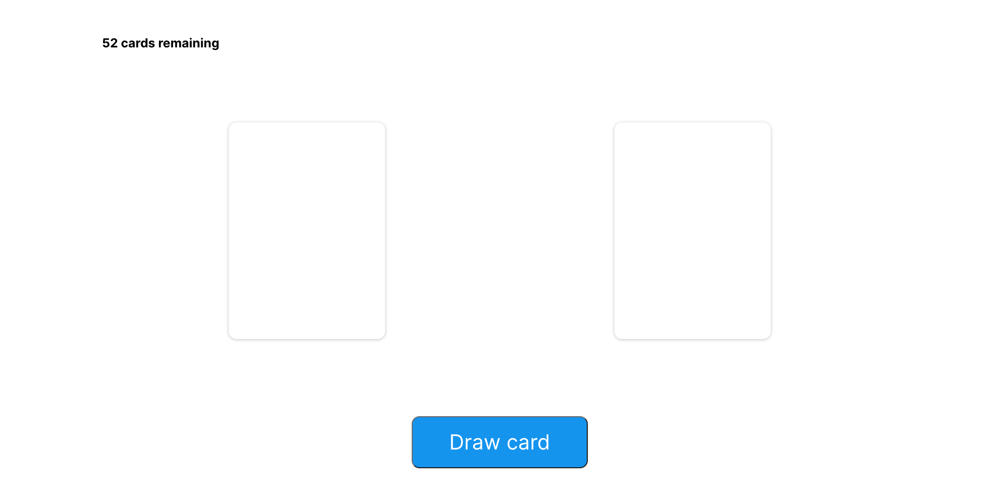
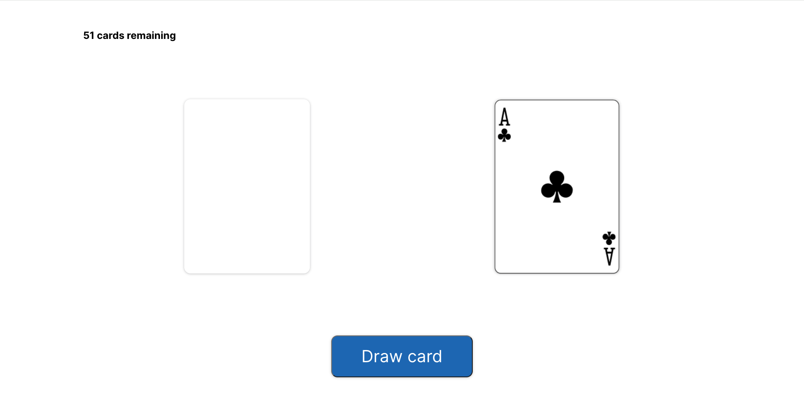
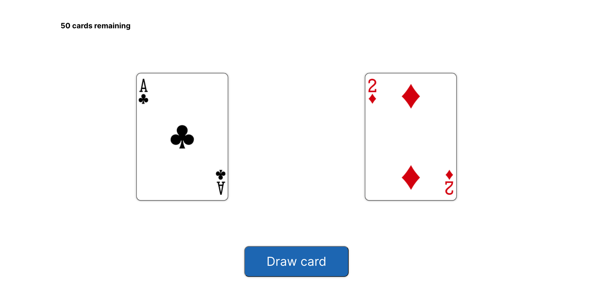
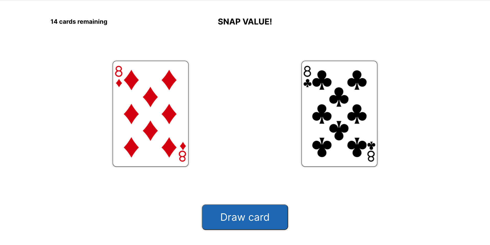
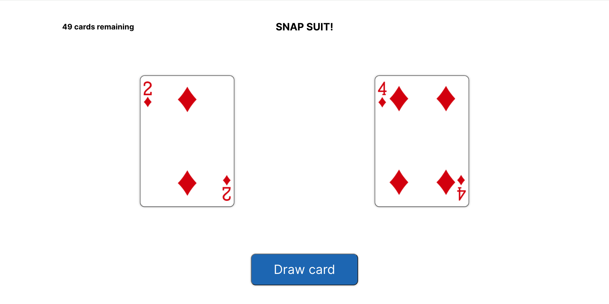
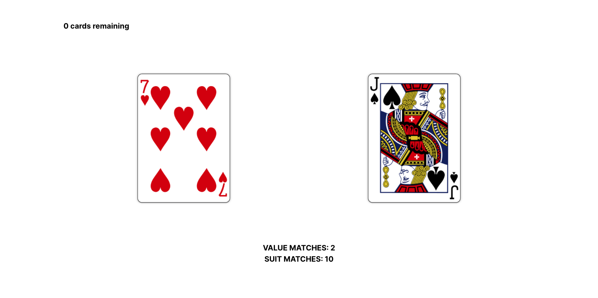

<h1 align="center">
👨🏻‍💻 Drivvn Tech Test 👨🏻‍💻 
</h1>

<p align="center">
A front-end web application allowing users to draw cards by clicking a button. It displays the number of remaining cards at the top. Whenever two cards match in either value or suit, it would show a message such as "SNAP VALUE!" or "SNAP SUIT!". When the deck runs out (no remaining cards), the button would disappear and be replaced by statistics showing the total number of matches for both value and suit.
</p>








## 🚀 Tech stack

**Frontend:**


**Testing:**


**Deployment:**
 <br>
Deployment link: [Drivvn Tech Test](https://drivvn-tech-test.onrender.com)

## 💻 Running the project

### Set up your project

1. Fork this repository
2. Rename your fork to `your-name`
3. Clone your fork to your local machine
4. Install Node.js dependencies.
```
; npm install
```

5. Install an ESLint plugin for your editor (optional). For example: [`linter-eslint`](https://github.com/AtomLinter/linter-eslint) for Atom.

### How to use the app

1. Start the front end application

```
; npm run dev
```

## 🧪 Running the tests

If you are interested in seeing our tests you can run them locally. 

In a new terminal session...

```bash

; npm run test
```

## 🫶 Special Thanks
[Drivvn](https://drivvn.com/) for giving me the opportunity to work on this cool tech test. 
